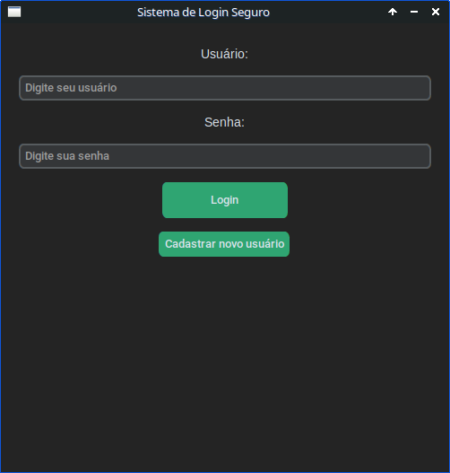
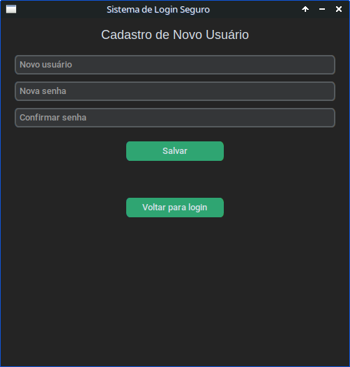

# PythonLogin
This repository is available in: 🇺🇸 [English](README.md) <br>
Este repositório está disponível em: 🇧🇷 [Português](README.pt.md) 

This project is a secure user login system implemented in Python using the [CustomTkinter](https://github.com/TomSchimansky/CustomTkinter) library for the GUI and [bcrypt](https://pypi.org/project/bcrypt/) for password hashing.

# Secure Login System with CustomTkinter and bcrypt

This project is a secure user login system implemented in Python using the [CustomTkinter](https://github.com/TomSchimansky/CustomTkinter) library for the GUI and [bcrypt](https://pypi.org/project/bcrypt/) for password hashing.

---

## Features

- **User registration** with secure password hashing (bcrypt)
- **User login** with password verification
- **Account management:**
  - View list of registered users with their registration date
  - Logout functionality
  - Delete your own account (except the admin account)
- Login attempt limit to prevent brute-force attacks
- User data stored securely in a local JSON file
- Login attempts logged with timestamps to a log file

---

## Requirements

- Python 3.7 or higher
- [CustomTkinter](https://pypi.org/project/customtkinter/)
- [bcrypt](https://pypi.org/project/bcrypt/)

---

## Installation

1. Clone this repository:
   ```bash
   git clone https://github.com/Gabrick75/PythonLogin
   cd secure-login-system
   ```
2. Install dependencies:
   ```bash
   pip install customtkinter bcrypt
   ```
---

## Usage
Run the main Python script:
   ```bash
   python3 login.py
   ```
---

## File Structure

- `login.py`: Main application script with GUI and logic.
- `usuarios.json`: Stores user data (auto-created).
- `log_acessos.txt`: Log file with login attempts (auto-created).

---

## Security Notes

- Passwords are hashed using bcrypt before storage.
- Maximum login attempts limit to prevent brute-force.
- Admin user is protected from deletion.
- User data stored locally in JSON (for demo purposes).

---

|  |  |
|:------------------------------:|:------------------------------:|
|  |  |


---

## License

This project is licensed under the MIT License. See the [LICENSE](LICENSE) file for details.

---

## Acknowledgments

- [CustomTkinter](https://github.com/TomSchimansky/CustomTkinter) for modern and customizable GUI components.
- [bcrypt](https://pypi.org/project/bcrypt/) for secure password hashing.

---

Feel free to contribute or open issues if you find any bugs or want to suggest features!
