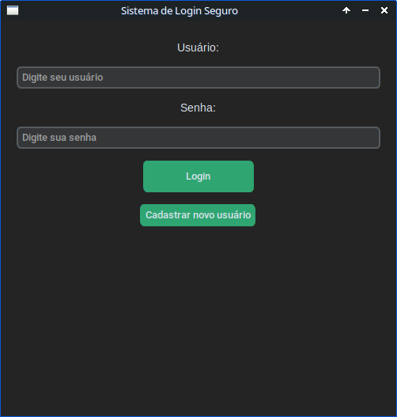
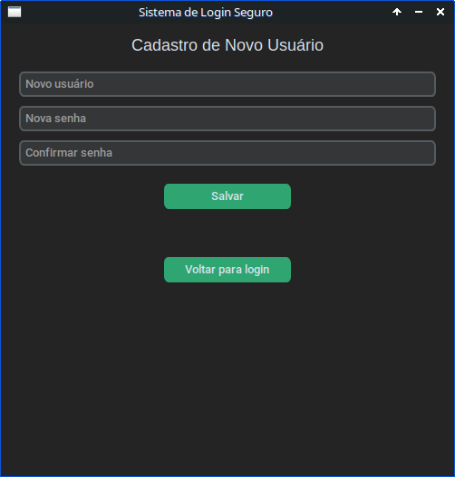
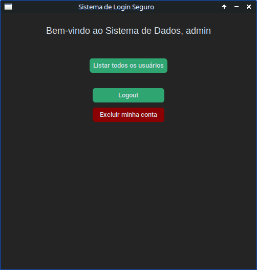
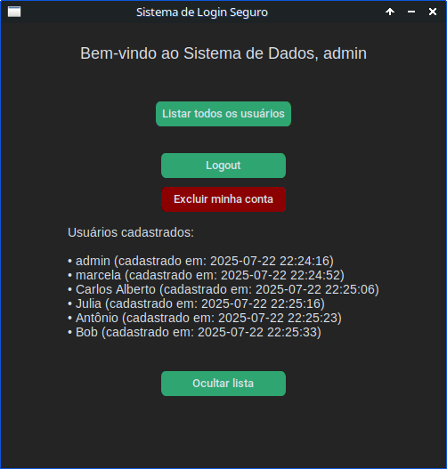

# PythonLogin
This repository is available in: 🇺🇸 [English](README.md) <br>
Este repositório está disponível em: 🇧🇷 [Português](README.pt.md) 

Este projeto é um sistema seguro de login de usuários implementado em Python, utilizando a biblioteca [CustomTkinter](https://github.com/TomSchimansky/CustomTkinter) para a interface gráfica e [bcrypt](https://pypi.org/project/bcrypt/) para o hash de senhas.

# Sistema de Login Seguro com CustomTkinter e bcrypt

Este projeto é um sistema seguro de login de usuários implementado em Python, utilizando a biblioteca [CustomTkinter](https://github.com/TomSchimansky/CustomTkinter) para a interface gráfica e [bcrypt](https://pypi.org/project/bcrypt/) para o hash de senhas.

---

## Funcionalidades

- **Cadastro de usuários** com hash seguro de senhas (bcrypt)
- **Login de usuários** com verificação de senha
- **Gerenciamento de conta:**
  - Visualizar lista de usuários cadastrados com data de registro
  - Funcionalidade de logout
  - Exclusão da própria conta (exceto a conta admin)
- Limite de tentativas de login para evitar ataques de força bruta
- Dados dos usuários armazenados com segurança em arquivo JSON local
- Tentativas de login registradas com data e hora em arquivo de log

---

## Requisitos

- Python 3.7 ou superior
- [CustomTkinter](https://pypi.org/project/customtkinter/)
- [bcrypt](https://pypi.org/project/bcrypt/)

---

## Instalação

1. Clone este repositório:
   ```bash
   git clone https://github.com/Gabrick75/PythonLogin
   cd PythonLogin
   ```
2. Instale as dependências:
   ```bash
   pip install customtkinter bcrypt
   ```
---

## Uso
Execute o script principal em Python:
   ```bash
   python3 login.py
   ```

## Estrutura dos Arquivos

- `login.py`: Script principal da aplicação com a interface gráfica e lógica.
- `usuarios.json`: Armazena os dados dos usuários (criado automaticamente).
- `log_acessos.txt`: Arquivo de log com as tentativas de login (criado automaticamente).

---

|  |  |
|:------------------------------:|:------------------------------:|
|  |  |

---

## Notas de Segurança

- Senhas são armazenadas usando hash bcrypt.
- Limite máximo de tentativas de login para prevenir ataques de força bruta.
- Usuário admin protegido contra exclusão.
- Dados dos usuários armazenados localmente em JSON (para fins de demonstração).

---

## Licença

Este projeto está licenciado sob a Licença MIT. Veja o arquivo [LICENSE](LICENSE) para mais detalhes.

---

## Agradecimentos

- [CustomTkinter](https://github.com/TomSchimansky/CustomTkinter) pela interface gráfica moderna e customizável.
- [bcrypt](https://pypi.org/project/bcrypt/) pelo hash seguro de senhas.

---

Sinta-se à vontade para contribuir ou abrir issues caso encontre bugs ou queira sugerir funcionalidades!

